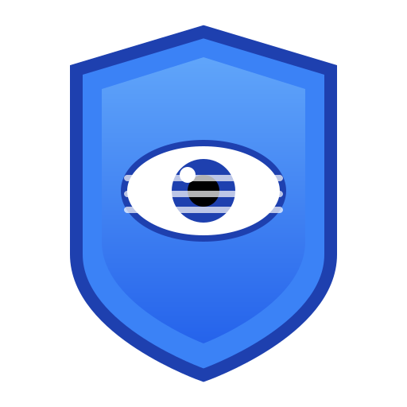

# PrivacyGnine

<div align="center">
  
  <h3>Privacy-Focused Image Anonymization</h3>
  <p>Protect sensitive information in your images with powerful, browser-based privacy tools.</p>
</div>

## 🛡️ About PrivacyGnine

PrivacyGnine is a privacy-focused image processing application that runs entirely in your browser. It allows you to anonymize photos by selectively blurring or hiding sensitive areas using multiple shape tools. All processing happens locally on your device - no data ever leaves your computer.

## ✨ Features

- **Multi-Shape Selection**: Choose from circles, rectangles, and ellipses to precisely select areas to anonymize
- **Color-Preserving Blur**: Apply a natural-looking blur that maintains the original image colors
- **Complete Hide Option**: Fully obscure sensitive information when needed
- **Adjustable Privacy Levels**: Fine-tune the intensity of privacy filters
- **Feathered Edges**: Create smooth transitions between original and processed areas
- **Client-Side Processing**: All image processing happens in your browser using TensorFlow.js
- **Touch-Friendly Interface**: Works seamlessly on mobile devices and tablets
- **Download Results**: Save your anonymized images for sharing or publishing

## 🚀 Getting Started

### Installation

```bash
# Clone the repository
git clone https://github.com/Mintahandrews/PrivacybyGnine.git
cd PrivacyGnine

# Install dependencies
npm install

# Start the development server
npm run dev
```

### Building for Production

```bash
npm run build
```

This will create a `dist` directory with optimized files ready for deployment.

## 🔧 Usage

1. **Upload an Image**: Click the upload button or drag and drop an image
2. **Select Areas**: Choose a shape tool (circle, rectangle, or ellipse) and draw over sensitive areas
3. **Adjust Settings**: Use the sliders to control blur intensity and other parameters
4. **Process**: Apply the privacy filter to your selected areas
5. **Download**: Save your anonymized image

## 🧪 Technologies Used

- **React** with TypeScript for the UI components
- **TensorFlow.js** for GPU-accelerated image processing
- **Canvas API** for drawing shapes and masks
- **Vite** for fast development and optimized builds
- **Tailwind CSS** for responsive styling

## 🔒 Privacy First

PrivacyGnine is designed with privacy as the top priority:

- No server-side processing - everything happens in your browser
- No data collection or tracking
- No external API calls for image processing
- Works offline after initial load

## 🤝 Contributing

Contributions are welcome! Please feel free to submit a Pull Request.

## 📝 License

This project is licensed under the MIT License - see the LICENSE file for details.
